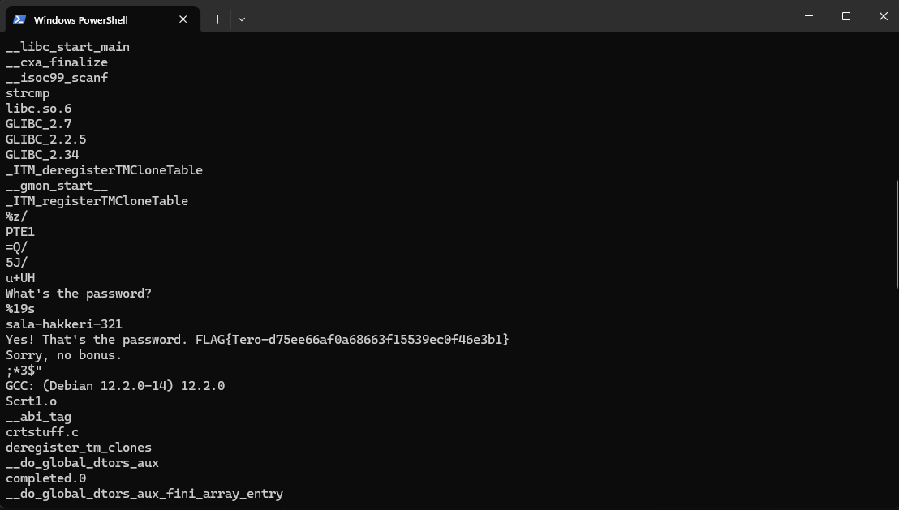
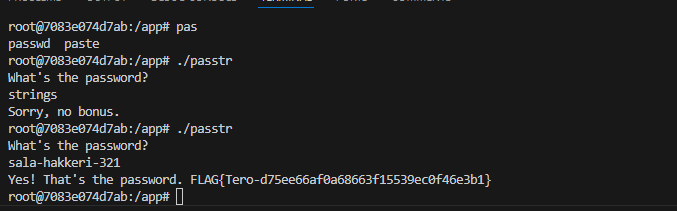
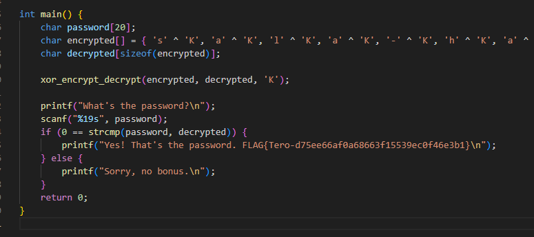
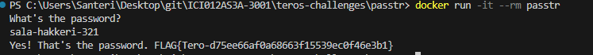
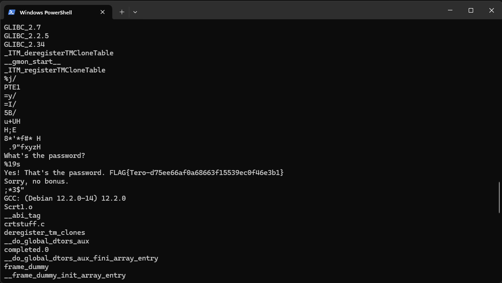
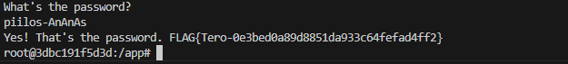

# No strings attached

### a)

Ensimmäisessä tehtävässä tulee selvittää salasana, jonka ohjelma passtr kysyy kun ohjelma ajetaan.

Materiaalissa viitataan Strings sovellukseen ja windowsille on tarjolla Strings.exe, joka selvittää ohjelman binääristä merkkijonoja.

Jos ohjelma on samassa kansiossa, voidaan ajaa strings komennolla '.\strings.exe .\passtr', joka esittää passtr ohjelmasta löytyviä merkkijonoja.



Yllä olevasta tuloksetsta voidaan päätellä ohjelman salasana. Vaikka se olisikin sekavampi salasana(ilman enkoodausta) voitasiin päätellä sen olevan salasana, muista selkokielisistä merkkijonoista. Rakenne/järjestys antaa osviittaa siihen että kyseessä on if-else lauseke ja teoriassa 'What's the password?' ja 'Yes! That's the password..jne' on arvo mitä vastaan käyttäjän syötettä verrataan.



Ajamalla ohjelma voidaan erikseen vielä varmistaa, että salasana on oikea

### b)

Ohjelma tulee korjata siten, että salasanaa ei näy binääristä, ainakaan helposti.

C kieli on itselleni aika vieras ja hakemalla suoraan googlesta, ei suoria vastauksia ongelmaan löytynyt, parhaimmillaan vinkkejä siihen mitä copilot(gpt 4o) tuotti.

AI ehdotti XOR enkryptausta/dekryptausta merkkijonoille, joka oli toimiva ratkaisu.

```
void xor_encrypt_decrypt(char *input, char *output, char key) {
    size_t len = strlen(input);
    for (size_t i = 0; i < len; i++) {
        output[i] = input[i] ^ key;
    }
    output[len] = '\0';
}
```

Copilotin avulla luotiin metodi, joka kryptaa ja enkryptaa sille syötetyn merkkijonon ja palauttaa käänteisen merkkijonon. 



Lähdekoodi korjattiin, piilottamalla salasana kryptaus metodilla. Korjaus kuitenkin vaati sen, että salasana on valmiiksi kryptattu, ettei se näy sellaisenaan binäärissä, joten copilotin avulla tehtiin apusovellus, joka tulostaa kryptatun version salasananasta, joka voidaan syöttää sellaisenaan korjattuun versioon.

```
#include <stdio.h>
#include <string.h>

void xor_encrypt(char *input, char *output, char key) {
    size_t len = strlen(input);
    for (size_t i = 0; i < len; i++) {
        output[i] = input[i] ^ key;
    }
    output[len] = '\0';
}

int main() {
    char original[] = "sala-hakkeri-321";
    char encrypted[sizeof(original)];
    char key = 'K'; // Salausavain

    // Salaa merkkijono
    xor_encrypt(original, encrypted, key);

    // Tulosta salattu merkkijono
    printf("Salattu merkkijono:\n");
    for (size_t i = 0; i < strlen(encrypted); i++) {
        printf("'%c' ^ '%c', ", original[i], key);
    }
    printf("'\\0'\n");

    return 0;
}
```
Testaamalla sovellusta selviää, että sama salasana toimii vielä normaalisti.


Ja Strings.exe ei enään näytä salasanaa tuloksissa.


### c)

Kolmannessa tehtävässä tulee selvittää uudestaan salasana, tällä kertaa toisesta ohjelmasta. Ohjelmaan ei ole tarjolla lähdekoodia, vaan se tulee päätellä pelkästään tiedostosta.

Strings ohjelmalla taas löytyi nopeasti if-else lauseke ohjelmasta.
```
What's the password?
piilos-An
Yes! T,
W. FLAG{Tero-0e3bed0a89d88
51da933c64fefad
f2}
S1ry
, no bonus.
```

Tällä kertaa, kuitenkin tuloksessa on "virheitä", eikä vastusta voi päätellä tästä suoraan. Pelkästään katsomalla strings tulostetta ongelma ei ratkennut, eikä sieltä löytynyt omaan silmään mitään tärkeää vinkki, miten tarkalleen salasana ja muut merkkijonot ovat sekoitettu, eikä Google haut eivät tuottaneet tulosta.

Ratkaisu ongelmaan kuitenkin löytyi strings tulosteesta, jonka AI bongasi.
```
$Info: This file is packed with the UPX executable packer http://upx.sf.net $
$Id: UPX 4.21 Copyright (C) 1996-2023 the UPX Team. All Rights Reserved. $
```
Ilman tarkempaa kontekstia, tästä ei välttämättä ole hyötyä ja ainakin itsellä se upposi muiden lyhyempien syötteiden sekaan. Tämä tuloste, kuitenkin kertoo että ohjelma on pakattu UPX ohjelmalla, joka on kompressoinut merkkijonot pakattuun muotoon. Komennolla '.\upx.exe -d .\packd' voidaan purkaa packd tiedosto, jonka jälkeen strings tulosteesta nähdään merkkijonot alkuperäisessä muodossa.
```
What's the password?
%19s
piilos-AnAnAs
Yes! That's the password. FLAG{Tero-0e3bed0a89d8851da933c64fefad4ff2}
Sorry, no bonus.
```

Testaamalla sovellusta, voidaan vielä varmistaa salasana ja flag.


### d) 

Cryptopals tehtäviin ei riittänyt hirveästi aikaa, mutta tein ensimmäisen tehtävän setistä, eli tavoitteena oli kääntää/enkoodata hex arvo base64 muotoon.

Tähän löytyi helposti netistä valmiita selainohjelmia, joilla toivottu tavoite voidaan tuottaa, mutta seuraavien tehtävän kannalta arvioisin, että on parempi itse tuottaa ohjelma sitä varten.

Valitsin node.js pohjaksi ohjelmalle, sillä koneellani oli node ja npm valmiiksi, eli kielenä ohjelmalla on javascript.
```
import { Base64 } from 'js-base64';
import { Buffer } from 'node:buffer';

const hex = Buffer.from('49276d206b696c6c696e6720796f757220627261696e206c696b65206120706f69736f6e6f7573206d757368726f6f6d', 'hex')

console.log(Base64.encode(hex));
```
Tällä lyhyellä ohjelmalla voidaan kääntää haluttu arvo, ensiksi hex muotoon Bufferilla ja sen jälkeen Base64 enkoodata se haluttuun muotoon. Buffer tarvitaan väliin, sillä Base64 käsittäisi suoraan syötettynä annetun arvon utf8 merkkijonona ja lopputulos vääristyisi.

### Alusta

Tehtävät tehty Dockerilla ja 64 bittisellä Windowsilla, ajoissa käytetyt Dockerfilet löytyvät /teros-challenges/passtr ja /packd

## Lähteet

ChatGPT / GitHub Copilot(gpt 4o)

https://learn.microsoft.com/en-us/sysinternals/downloads/strings

https://upx.github.io/

https://www.npmjs.com/package/js-base64

https://nodejs.org/api/buffer.html#buffer