# Kääntöpaikka

### x)

- kannattaa tutkia lausekkeita ghidralla
- Ghidralla voi tehdä aikalailla kaiken mitä esim. stringillä voi

### a)

Ensimmäisessä varsinaisessa tehtävässä tulee asentaa Ghidra, joka on staattisen analyysin työkalu.

Ghidran asennuspakin löytää githubista, eikä sitä tarvitse varsinaisesti asentaa, vaan se toimii suoraan githubista saadun paketin purkamisen jälkeen.

Omalle koneelle Ghidra ei tarvinnut ylimääräisiä paketteja, mutta muille se voi vaatia Javan Dev kitin, jos sitä ei valmiiksi löydy koneelta.

Ghidran julkaisut: https://github.com/NationalSecurityAgency/ghidra/releases

### b)

B osiossa pitää käyttää ghidraa ja käänteismallintaa h3 tehtäväpaketissa saatu packd binääritiedoston main luokka C kielellä.

Kun ghidra on analysoinut tiedoston, voidaan avata suoraan decompile ruutu, sekä valita symbol tree ikkunasta funktioiden alta main, jonka ghidra on tässä tapauksessa tunnistanut binääristä suoraan.

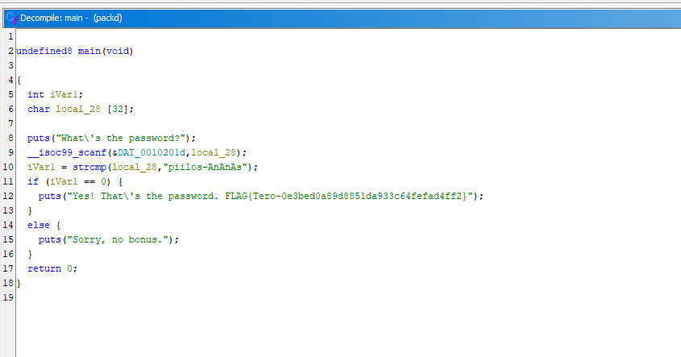

Decompile ikkunasta näkyy "raaka" Ghidran luoma versio C koodista, jota voidaan muokata selkokielisemmäksi, muuttamalla muttujien nimiä ja manuaalisesti lisäämällä määrittämättömiä parametrejä, esim. main luokkaan.

Aluksi mainin palautus parametri on määritetty undefined8, eli ghidra ei osannut päätellä suoraan mitä main tarkalleen palauttaa. C Kielessä lähtökohtaisesti main, eli entry luokka palauttaa aina kokonaisluvun ja tämän voi myös päätellä return lausekkesta, jossa luokka palauttaa 0, eli int main luokan palautus parametri, tulee muuttaa int main(void)

Ghidrassa, voidaan muokata palautus tyyppiä maalamalla/klikkaamalla haluttua kohtaa ja painamalla ctrl + L tai oikealla hiiren näppäimellä avaamalla valikon ja valitsemalla "Retype Return", joka avaa dialogin jolla voidaan muokata haluttua kohtaa.

Seuraavaksi voidaan nimeät ensimmäinen muuttuja iVar1, selkokielisemmäksi. Parametristä selviää, että kyseessä on kokonaisluku ja koodista voidaan päätellä, että sille annetaan varsinainen arvo strncmp funktiolla, joka vertaa kahta merkkijonoa ja palauttaa kokonaislukuna eroavaisuudet, 0 tarkottaisi, että merkkijonot ovat identtiset. Muuttuja voidaan siis nimetä, esim. differences ja se tapahtuu maalamalla/klikkaamalla kohtaa, jossa se julistetaan alussa tai myöhemmin referoidaan. Oikean klikin valikolla tai L näpillä, voidaan avata dialogi, jolla voidaan vaihtaa muttujan nimeä.

Viimeinen jäljellä oleva muuttuja on merkkijono, joka saa arvonsa käyttäjän syötteestä ja sitä verrataan myöhemmin strncmp funktiolla kovakoodattuun merkkijonoon. [32] julistuksessa viittaa merkkojonon maksimipituuteen, mutta se ei tässä tapauksessa auta. Muuttujan nimeksi voidaan antaa esim. input ja se tapahtuu samalla tavalla, kuin edellinen muuttuja.

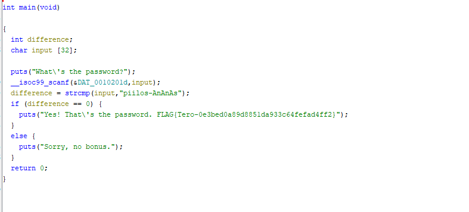

Lopputulos on seuraavan näköinen koodi, joka pyytää käyttäjältä syötteen, vertaa sitä kovakoodattuun merkkijonoon ja paluttaa, joko myönteisen vastausken ja lipun, jos syötteen ja kovakoodatun merkkijon välillä ei ole yhtään eroa. Muuten koodi palauttaa kielteisen tulosteen.

Tehtävässä tulee myös ratkaista binäärin tehtävä eli flag ja tässä tapauksessa, se näkyy kuvista, eli  FLAG{Tero-0e3bed0a89d8851da933c64fefad4ff2}

### c) 

Seuraavassa osiossa pitää muokata edellisen viikon passtr binääriä, siten että se hyväksyy kaikki paitsi oikeat salasanat. Tehtävässä ei tule käyttää lähdekoodia, vaan muokkaukset pitää tehdä suoraan binääriin.

Ghidrasta näkee, että decompile on melkein identtinen packd binäärin kanssa, joten tällä kertaa muuttujia ja parametreja on jokseenkin turha muokata selkokielisemmäksi. Sen sijaan on hyvä avata "Listing:" ikkuna, joka näyttää binääristä luotua assembly koodia, jota tässä tehtävässä muokataan.

Jos Decompile ikkunan puolella valitaan if ehtolauseke, ghidra automaattisesti hyppää listing ikkunassa, sille riville joka vastaa sitä assemblyn puolella, josta taas selviää, että kyseessä on JNZ komento. 

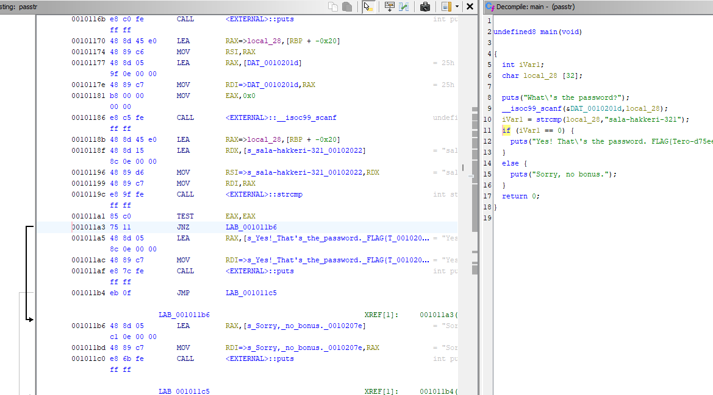

JNZ komento, eli jump if not zero on ehdollinen hyppy, joka siirtää ohjelman ajon jollekin riville, jos ehto täyttyy. Kuvasta voi näkyä hieman huonosti, mutta assemblyn puolella ohjelma toimii seuraavasti; Ohjelma vertaa ehtoa ja palauttaa nollan tai ykkösen, riippuen täyttyykö ehto vai ei. Jos ehto palauttaa nollaan, hypätään ohjelmassa kohtaan LAB_001011b6, joka ajaa kielteisen tulostuksen ja jatkaa ohjelmaa. Jos taas ehto palauttaa ykkösen, ei ehdollista hyppyä tehdä ja ohjelma jatkaa ajoa tulostaen myönteisen tulosteen ja lipun.

Ghidralla voidaan manipuloida koodia siten, että vaihdetaan JNZ käänteiseksi, eli JZ jump if zero, jolloin ohjelma toimii myöskin käänteisesti, eli väärällä salasanalla tulostetaan myönteinen ja niin päin pois. Manipulointi tapahtuu valitsemalla JNZ rivin ja oikein klikin valikosta kohdalla "Patch Instruction" tai painamalla ctrl + shift + g.


Assembly muutoksen näkee myös suoraan decompile ikkunasta, jossa ohjelman uusi rakenne näkyy suoraan.

Binääri voidaan viedä uudessa muodossa Ghidrasta painamalla O tai yläkulman File valikosta "Export Program". Aukeavasta dialogista tulee valita formatiksi "Original File", sekä output fileä olisi hyvä muokata, jotta binäärit ei mene sekaisen.

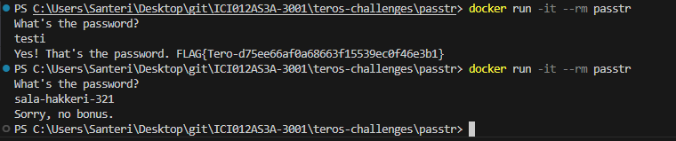

Ohjelmaa ajamalla selviää, että binäärin manipulointi on onnistunut ja se tuottaa toivotun lopputuloksen.

### d) 

D osiossa pyydetään kääntämään NoraCodesin Crackme paketteja seuraavia tehtäviä varten. Paketin mukana tuleva readme ohjeilla voidaan luoda Dockerfile, joka kääntää tarvittavat paketit binääreiksi.
```
FROM debian:bookworm

WORKDIR /app

COPY . .

RUN apt-get update

RUN apt-get install -y make gcc micro

RUN make crackme01
```

Lisäämällä RUN make komentoja, voidaan kääntää useampi ohjelma, mutta tässä tapauksessa käännetään vain ensimmäinen. Imagen luonnin jälkeen voidaan käyttää seuraavaia komentoja;
```
docker create --name comp crackmecompiler
docker cp comp:/app/crackme01.64 ./crackme01.64
docker rm -f comp

```

Tällä tavalla luodaan kontti, mutta sitä ei ajeta. cp komento siirtää luodun crackme01.64 binäärin host koneen terminaalin root kansioon.

Samaa imagea ajamalla, eli 'docker run -it --rm < image >' voidaan testata binääreita ja ratkaista tehtäviä

### e) 

Tässä tehtävässä tulee ratkaista äsken käännetty crackme01, ilman että binääriä varsinaiseti muokataan. Ghidran avulla pitää päätellä miten ohjelma saadaan ajettua "läpi".

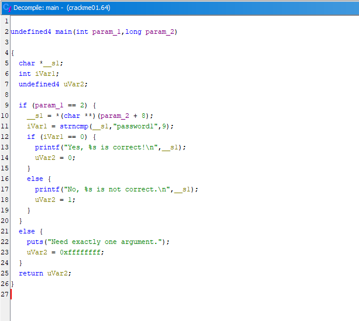

Ghidra taas tunnisti entry pointin ja nimesi main funktion oikein ja se voidaan avata decompile ikkunaan tutkittavaksi.

Main voidaan taas vaihtaa Integeriksi ja sen voi vielä varmistaa tarkastelemalla return lausekkeen arvoa, joka on int muuttuja. Samalla vaivalla voidaan myös nimetä kyseinen Int muuttuja, esim. status tai code. Readme puhuu palutettavista status koodeista, joten nimi on ihan kuvaava ja toivottu lopputulos on se, että return lausekkessa palautuu kokonaisluku 0.

Toinen muuttuja on merkkijono pointteri, joka oletettavasti viittaa argumenttiin, joka ohjelmalle annetaan sitä ajaessa, eli voidaan nimetä argument.

Mukautettuna koodi siis näyttäisi tältä
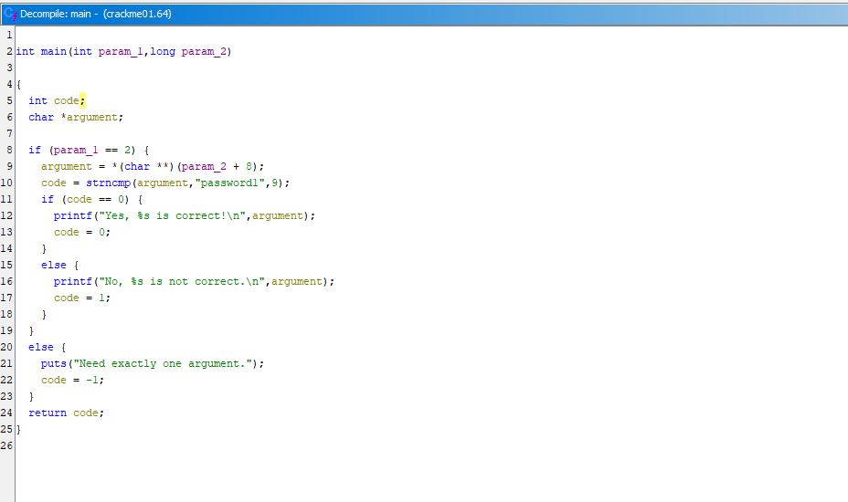

Tästä ei tarkemmin tarvitse tietää, kuin rivin 10, jossa argumentti verrataan strncmp funktiolla kovakoodattuun merkkijonoon, eli ohjelman saa palauttamaan 0, jos argumentiksi annetaan password1.

Vapaavalintaista g) tehtävää voi avata tässä samalla, eli kysytään useampaa tapaa ratkaista tehtävä. Strncmp funktiolle annetaan kolmas parametri kokonaisluku 9. En löytänyt dokumentaatiota tähän funktioon, joka olisi selventänyt sen merkitystä, mutta AI osasi antaa oikean vastauksen, eli 9 viittaa siihen mihin asti merkkejä tarkistetaan jonossa.

Tässä tapauksessa, argumentin ensimmäiset 9 merkkiä verrataan kovakoodattuun salasanaan, eli kunhan ensimmäisenä argumentissa lukee password1, voidaan sen perään kirjottaa mitä tahansa ja ohjelma palauttaa nollan.

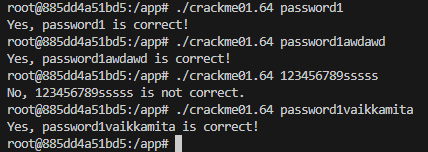

Ilman tarkempaa C tietämystä tai binääri manipulaatiota on vaikea sanoa, onko tähän muita ratkaisuja.

Crackme01e binääri on rakenteeltaan samanlainen, kuin 01 enkä kokenut tarpeelliseksi mukauttaa sitä sen enempää. Kovakoodattu salasana oli tällä kertaa slm!pass.k ja edellisen tavoin ensimmäiset 10 merkkiä tarkistetaan pelkästään.

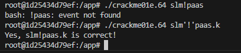

Jos argumentin antaa sellaisenaan, ohjelma tunnistaa ! merkin eventtinä, joten se pitää kiertää laittamalla huutomerkki puoliheittomerkkien sisään, jolloin ohjelma ajaa itsensä loppuun ja saadaan haluttu lopputulus.

En kokeillut tällä kertaa lisätä merkkejä perään, mutta olen suhteellisen varma, että se toimii samalla tavalla kuin edellinen.

f)

Tällä kertaa tehtävän on mukauttaa crackme02 selkokieliseksi, selittää sen toiminta, sekä ratkaista binääri.

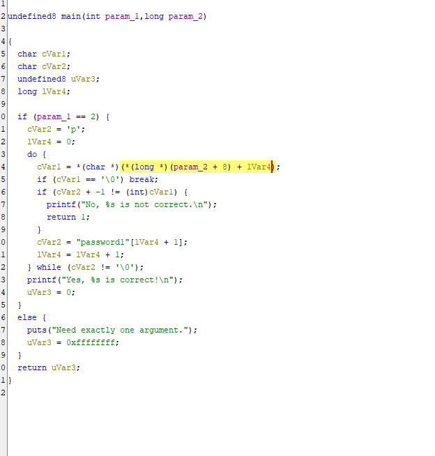

Mainin vaihdetaan suoraan int tyyppiseksi ja uVar3 statusCodeksi, sillä main ja uVar3 on int tyyppinen mainin takia ja se palautetaan status koodina.

long lVar3 voidaan nimetä iteration, sillä se toimii do while loppissa iteraation indeksinä tai lukuna, eli per kierros/iteraatio siihen lisätään 1.

cVar1 voidaan vaihtaa inputiksi ja cVar2 voidaan vaihtaa passwordiksi. cVar1 iteroi merkkijonoa jonka käyttäjä antaa(oletettavasti), kun taas jälkimmäinen iteroi kovakoodattua salasanaa 'cVar2 = "password1"[iVar4 + 1]'

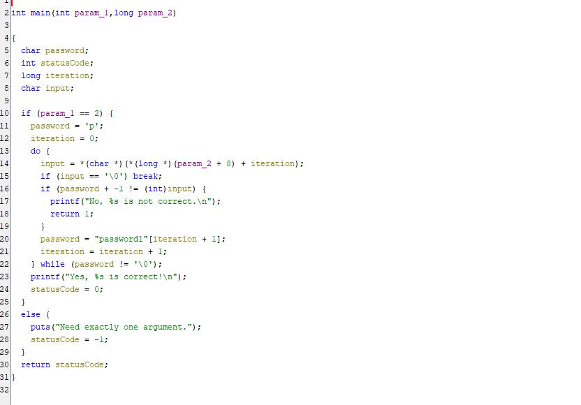

Muotoillusta ohjelmasta voidaan päätellä, että ohjelma vertaa argumenttiä kovakoodattuun salasanaan iteroimalla niitä merkki kerrallaan do while loopissa, jos merkit ei vastaa toisiansa tulostetaan kielteinen tuloste ja palautetaan status koodi 1.

Merkkien tarkistuksessa kuitenkin käytetään algoritmiä, eikä salasana ole 1:1 kovakoodatun kanssa.
password + -1 viittaa siihen, että ehdossa verrattava merkki on ascii taulukossa edellinen merkki, eli -1.
Tässä tapauksessa oikea salasana on siis password1 käännettynä yhden merkin alaspäin, eli o`rrvnqc0

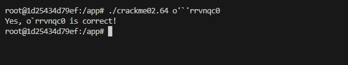

### i)

crackme02e sisältää samanlaisen rakenteen kuin 02, mutta algoritmi ja kovakoodattu salasana on muutettu.

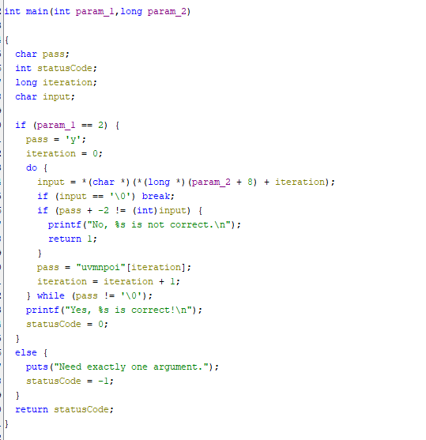

Nyt iteraatio vertaa ascii arvossa -2, tarkastus alkaa myös y kirjaimella, eli kovakoodatun salasanan pitäisi olla yvmnpoi, eli -2 arvolla käännetynä wstklnmg

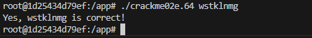

## Lähteet

https://stackoverflow.com/questions/22049212/copying-files-from-docker-container-to-host

https://github.com/NoraCodes/crackmes

https://www.programiz.com/c-programming/c-pointers

https://www.asciitable.com/