# Se elää

### a)

Ensimmäisessä tehtävässä tulee selvittää mikä annetussa ohjelmassa on vikana ja miten se korjataan. Työkaluina tähän käytetään GNU debuggeria, mutta kyseisen ohjelman ongelma ratkeaa ajamalla sitä ja katsomalla lähdekoodia.

Ohjelmassa ei anneta tarkempaa kontekstia, sille mikä ohjelman toivottu lopputulos, mutta isoin ongelma näyttää olevan "Segmentation fault" virhe.

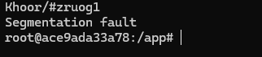

Lähdekoodista kuitenkin selviää, että ohjelman toivottu lopputulos olisi "sekoitettu" printtaus kovakoodatulla viestille "Hello, world.". 

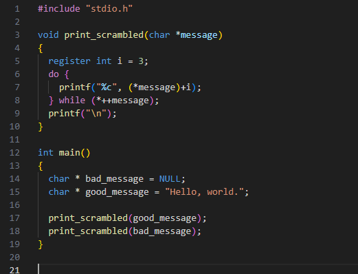

Ohjelman tulostusta ja lähdekoodin 7 riviä tarkistelemalla voidaan päätellä, että sekoitus tapahtuu muuttamalla merkkijonon merkit 3 arvoa suuremmaksi ASCII taulukossa, mukaan lukien välilyönnit, pilkun ja pisteen.

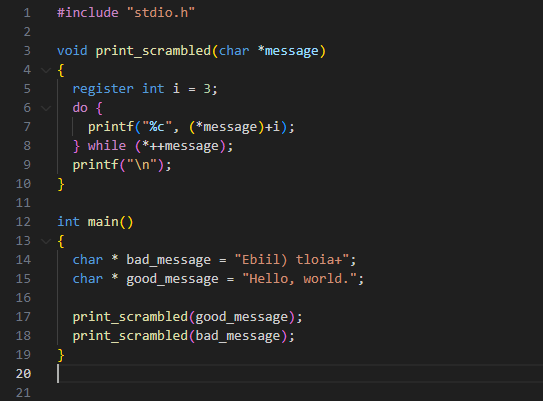

Segmentaatio ongelma voidaan ratkaista asettamalla toiselle muuttujalle arvo, sillä virhe johtuu todennäköisemmin siitä, että pointer on NULL, eli se ei sisällä arvoa, jota print_scrambled funktio ei osaa käsitellä ollenkaan.

Lisätty arvo on sama viesti, mutta -3 arvoilla poislukien välilyönnin, jonka arvo olisi ollut jonkin sortin erikoismerkki GS(GroupSelector). Eli välilyönti vaihtuu risuaitaan(#) samalla tavalla, kuin sekoitettu viesti.

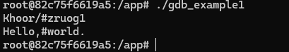

On vaikea sanoa ilman kunnollista kontekstia, onko ohjelmassa muuta korjattavaa, mutta tällä korjauksella ohjelma ajaa itsensä loppuun normaalisti ilman virhekoodia.

### b)

Seuraavassa tehtävässä tulee etsiä lippu ja salasana binääristä GNU debuggerilla. Tehtävässä ei saa käyttää staattisia työkaluja, jolla salasanan voisi saada luultavasti helpostikkin selville.

Ohjelma on muokkattu versio aikaisempien pakettien passtr ohjelmasta. Ajamalla ohjelma voidaan todeta, että tulosteet ovat samoja kuin ennen.
```
What's the password?
""
Sorry, no bonus.
```
Ohjelma on käännetty ilman debugger tilaa, joten käytössä on vain assembly komennot ja rekisterin arvot.

Ennen kuin ohjelmaa varsinaisesti ajetaan, voidaan lisätä siihen auttavia breakpointteja, joiden avulla ohjelma pysäyttää ajon ja se voidaan segmentoida. Komennolla 'break main' voidan segmentoida ohjelman ajo siten, että joikainen main komentorivi toimii breakpointtina. 'next' komennolla voidaa edetä breakpointeissa ja 'nexti' voidaan edetä assemblyssä rivi kerrallaan.

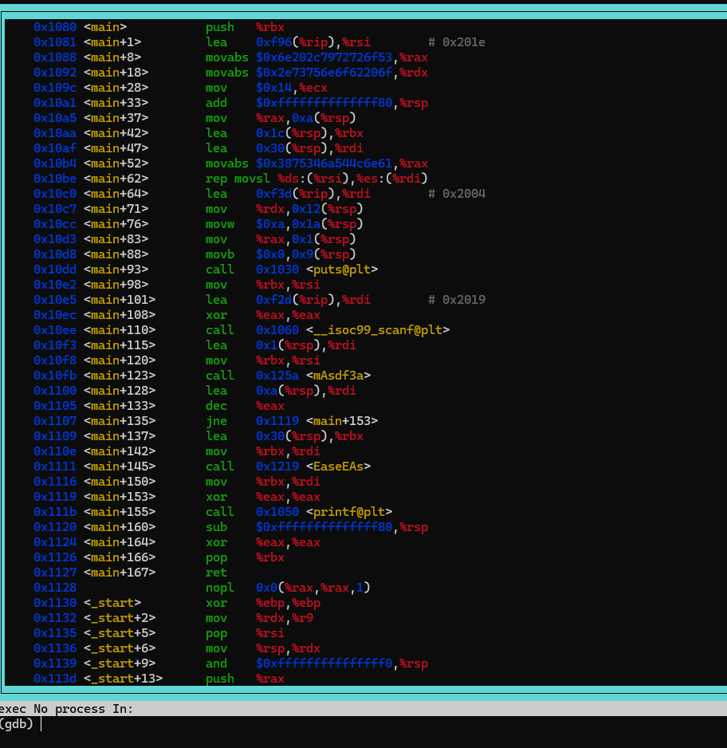

Komennoista ei itsessään vältämättä suoraan selviä mitään, mutta ajamalla ohjelmaa rivi kerrallaan selviää kuitenkin tärkeitä asioita.

MOV ja LEA komennot siirtävät ja alustavat rekisterissä arvoja, ohjelman edetessä, mutta tästä on varsinaisesti hyötyä vasta main+110 rivin jälkeen, jolloin käyttäjä on saanut antaa syötteensä ja se on rekisterissä tallessa. Seuraavalla rivillä MOV komennolla siirretään rdi osoitteeseen kryptattu kovakoodattu salasana, joka voidaan printata komenolla;
```
p(char*) $rdi
```

Tämä komento printtaa osoitteen sisällön, joka on tässä tapauksessa 'anLTj4u8'. Samaa komentoa käyttäen voidaan tulostaa rsi osoitteen arvo, joka on syötetty salasana.

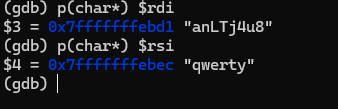

Seuraava mielenkiintoinen komentorivi on main+123, jossa kutsutaan mAsdf3a. Ilman uusia breakpointteja debugger ajaa tämän yli ja print (p) komennolla, selviää että rdi on alustettu kielteisellä viestillä. Tästä voidaan päätellä, että kutsun aikana salasanoja verrataan ja dekryptataan oikeaan muotoon. 

Komentoihin pääsee käsiksi lisäämällä uuden breakpointin komennolla;
```
break mAsdf3a
```

Ajamalla uuden breakpointin kanssa kutsuun asti, saadaan kutsutun funktion komennot auki

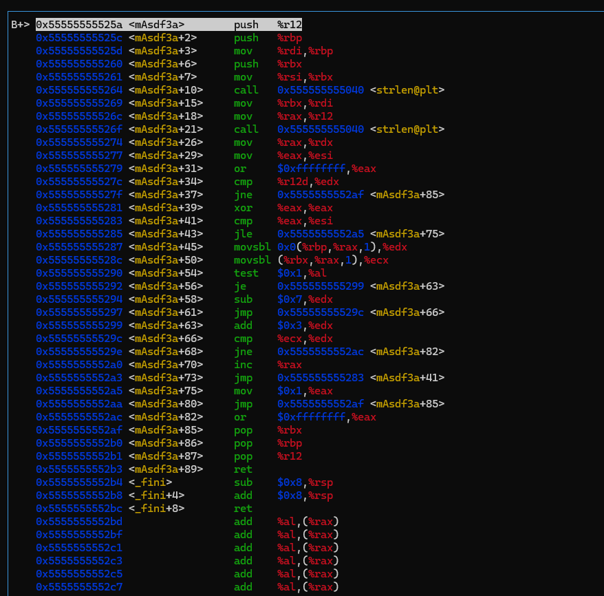

Ensimmäinen ohitettava haaste on strlen ja sen jälkeinen vertaus rivillä +34. Eli syötetyn salasanan tulee olla yhtä pitkä kuin kovakoodatun, jotta ohjelmaa jatkaa ajoa. kryptatty salasana on oletettavasti yhtäpitkä kuin dekryptattu, joten ohjelmalle tulee syöttää 8 merkkiä pitkä salasana.

Tämä voidaan vielä tarkastaa print komennolla ja tutkia kahden verrattavan osoitteen arvoja manuaalisesti, 0x8 viittää tällä kertaa suoraan numeraaliseen arvoon 8.

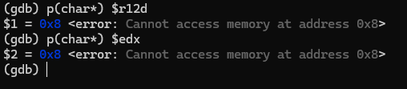

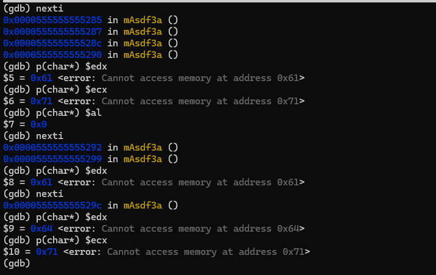

- $al on iteraatioiten välissä vaihtuva binääri, joka määrää vähennetäänkö vai lisätäänkö merkkiin arvoa 0 lisää 1 vähentää
- $edx on osa kovakoodatusta merkkijonosta, jota on tässä tapauksessa korotettu kolmella, $ecx on taas vastaava osa syötetystä merkkijonosta

Tarkastelemalla komentoja ja ajamalla ohjelmaa, voidaan päätellä, että kryptays tapahtuu vähentämällä tai lisäämällä merkkeihin ascii arvoja. Ensimmäiseen merkkiin lisätään 3, jonka jälkeen palataan noutamaan jonojen seuraavat merkit j atällä kertaa vähennettään verrattavasta merkistä 7. Sen jälkeen taas lisätään 3 jne.

Komennoista ei varsinaisesti selviä, millä välillä $al vaihtuu, mutta ajamalla ohjelmaa ensimmäisellä oikealla merkillä, voidaan päätellä, että vaihtuvuus lisäämiestä -> vähentämiseen tapahtuu yhden iteraation välein, mutta voidaan tällä kertaa olettaa ja kokeilla salasanaa suoraan ohjelmassa ja varmistaa hypoteesi algorimistä.

Ohjelma vaihtelee merkkien välien +3 ja -7, jolloin oikea salasana on 'anLTj4u8' jonosta kääntäen 'dgOMm-x1'.

Ajamalla ohjelma saadaan saadaan myös lippu esille, eli 'FLAG{Lari-rsvRDx04WMBZpuwg4qfYwzdcvVa0oym}'

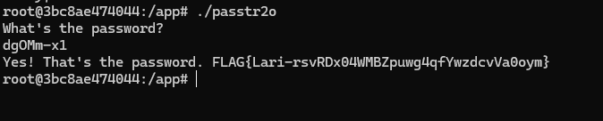

### c)

Kolmanessa tehtävässä tulee ratkaista Nora Crackmes paketista vähintään harjoitukset 3 ja 4. Käytössä on taas pelkkkä debugger.

### crackme03

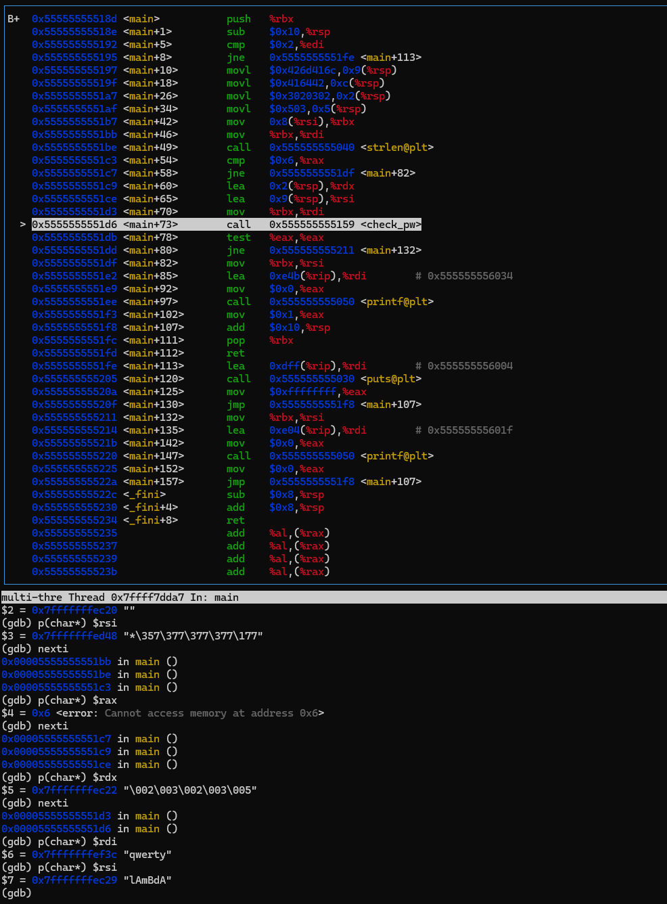

Hypätään suoraan samat alku askareet mitä tehtiin edellisessä tehtävässä ja aloitetaan main lohkosta riviltä, josta kutsutaan check_pw funktiota, jolle on lisätty oma breakpoint.

Rekisteri on alustettu siten, että $rdi on syötetty merkkijon ja $rsi on kovakoodattu, eli 'lAmBdA', joka on nopean ajo testin jälkeen kryptattu.

Eli tehtäväksi jää selvittää millä algoritmillä merkkijonot kryptataan/dekryptataan, oletettavasti check_pw funktiossa.

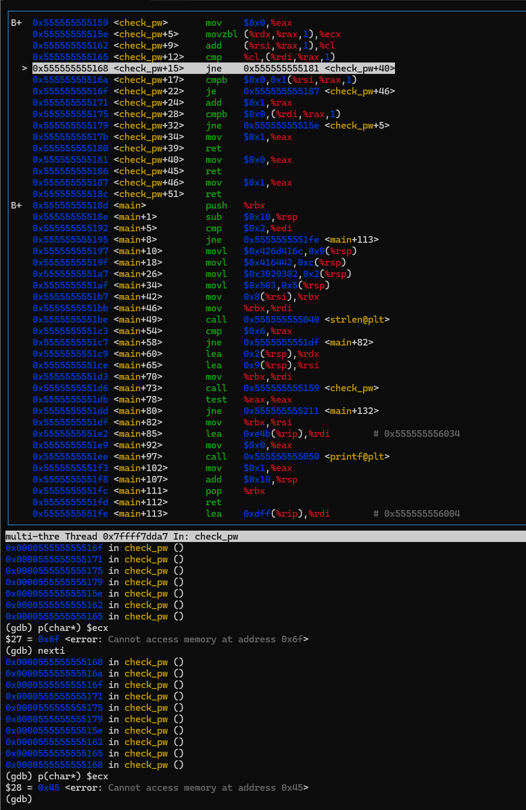

Funktio tarkistaa merkkijonot merkki kerrallaan ja lisää "oikeaan" merkkiin arvoa algoritmin mukaisesti.

On vaikea sanoa suoraan komennoista, mikä algotrimi mahtaa olla, mutta oikea merkki löytyy kummastakin $ecx ja $cl ositteesta. $rax on iteraation indeksi. Syötetyn jonon merkkejä ei suoraan alusteta mihinkään osoitteeseen vaan niitä verrataan suoraan seuraavalla syntakstilla ($rdi, $rax, 1), eli osoite, iteraatio ja 1.

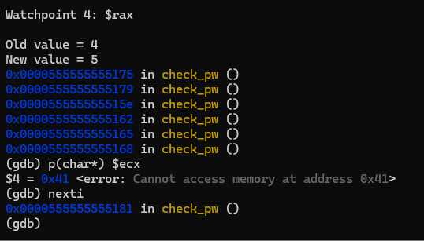

Koska algoritmi ei suoraan selviä komennoista, voidaan salasanaa iteroida, sillä aina ennen vertaamista oikea merkki paljastetaan kahdessa eri osoitteessa. Iteroinnin helpottamiseksi voidaan lisätä pelkästään check_pw funktion breakpoint ja käynnissä olevan ohjelman aikana lisätä watchpoint iteraation osoitteeseen, jotta pysytään kärryillä.

Iteroimalla salasanaa, voidaan selvittää, että algoritmi ja oikea sana on seuraava.

```
lAmBdA -> nDoEiA
+2 - +3 - +2 - +3 - +5 - +0
```

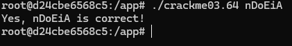

### crackme04

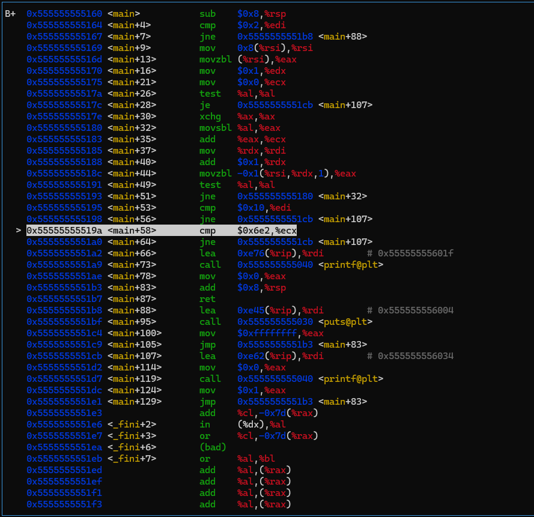

Ohjelma ei tällä kertaa sisällä kutsuttavia funktiota ja ohjelma käydään läpi kokonaisuudessaan main:ssä.

Komennoissa ei suoraan selviä osien osoitteiden arvon asetusta, mutta tässä ovat seuraavat tärketät osoitteet.
- +53 kontekstissa $edi on annetun argumentin merkkijonon pituus
- $ecx on kaikkien annettujen merkkien yhteenlaskettu summa
- $rdx on iteraatio

Osoitteista voi jo päätellä, että tällä kertaa haussa ei ole kovakoodattu merkkijono mihin syötettä verrataan, vaan merkkijonon pituutta verrataan arvoon 0x10 ja merkkien summaa arvoon 0x6e2. Kummatkin ovat hexadesimaali muodossa, eli syötteen tulee olla 16 merkkiä pitkä ja jokaisen merkin yhteenlaskettu summa tulee olla 1762. Merkkijonon sisällöllä ei muuten ole väliä.

Copilot(gpt 4o) osasi luoda seuraavan python koodin, jolla vastaavan merkkijonon voi luoda

```
import random
import string

def generate_string(target_sum, length):
    while True:
        result = ''.join(random.choices(string.ascii_letters + string.digits + string.punctuation, k=length))
        if sum(ord(c) for c in result) == target_sum:
            return result

target_sum = 1762
length = 16
result = generate_string(target_sum, length)
print(f"Generated string: {result}")
```

Ohjelma luo randomilla merkkijonon, jonka summa on 1762 ja pituus 16. Itselle se antoi seuraavan tulosteen
```
Generated string: {i}{Fo|]zb}S}lmv
```

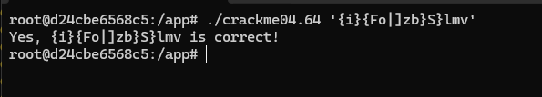

Testaamalla ohjelmaa voidaan todeta, että ohjelma toimii. Puoliheittomerkeillä varmistetaan, että syöte luetaan datana, eikä sitä yritetä tulkita.

## Alusta

Debuggeria ajettiin kontissa, dockerfile löytyy /bgd kansiosta

## Lähteet

https://decimal.info/

https://www.asciitable.com/

https://terokarvinen.com/application-hacking/#laksyt

https://darkdust.net/files/GDB%20Cheat%20Sheet.pdf