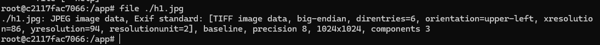
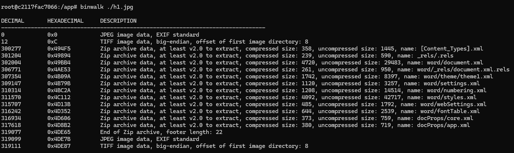
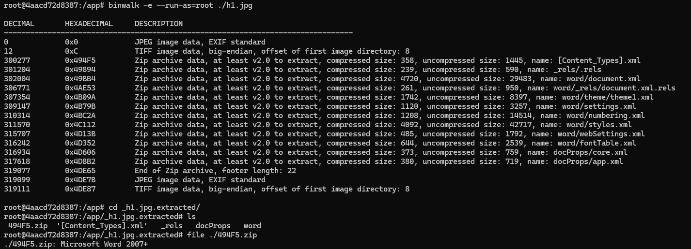
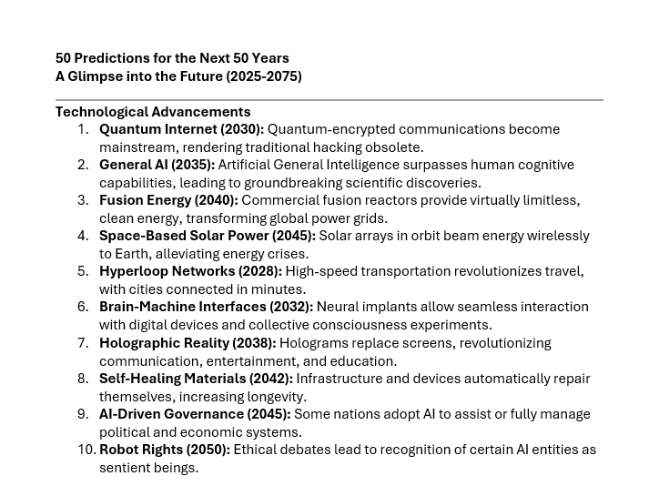
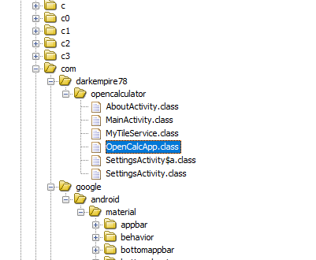
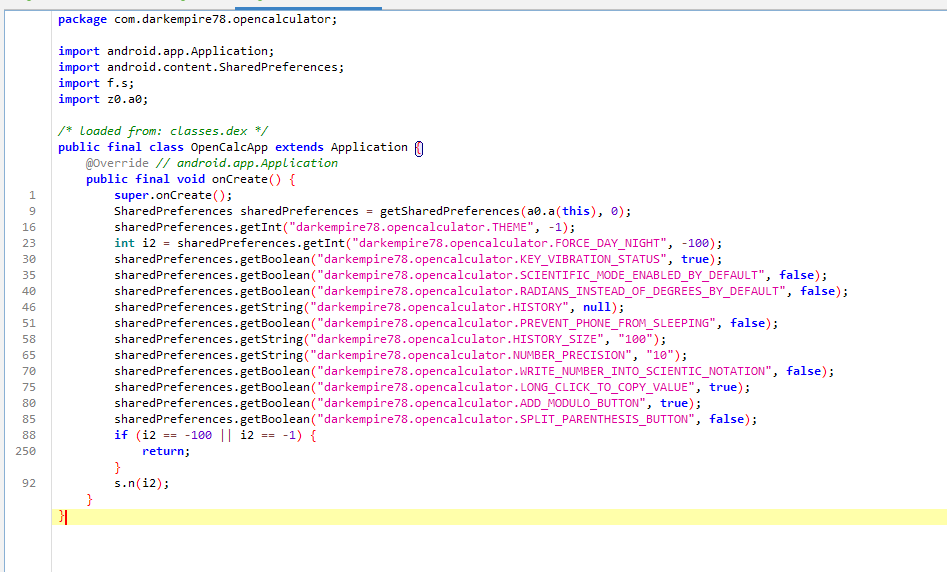

# Sulaa hullutta

### a) 

Ensimmäisessä tehtävässä tulee tutkia materiaaliksi annettua .jpg tiedostoa aikaisemmilla työkaluilla.

Stringsillä tiedostosta ei ainakaan omaan silmään osunut mitään, joten ainakin sellaiseenaan binääri ei sisällä luettavia merkkijonoja.

Ghidran ja GNU debugurrin voi tällä hetkellä vielä sivuttaa, sillä tiedostoa ei voida ajaa ja ghidra ei tunnista sitä.

Luennolle näytetty 'file' ei myöskään näytä mitään poikkeavaa tiedostossa.



Näillä työkaluilla analysoituna, tiedosto näyttää olevan aivan normaali kuva .jpg muodossa.

### b)

Seuraavaksi tiedostoa tulee tutkia binwalk työkalulla.

Jos binwalk ajetaan ilman parametrejä, se paljastaa jo aika paljon tiedostosta.



Tulosteesta päätellen tiedosto sisältää pakattua dataa 

Jotta tiedosto voidaan purkaa tarvitaan binwalkin lisäksi Java(jdk), sekä unzip työkalu, joita binwalk käyttää purkamaan tiedostoa. Dockerfile sisältää tarvittavat riippuvuudet, vaikkakin unzip näyttäisi olevan riittävä.

Komennolla;
```
binwalk -e --run-as=root ./h1.jpg
```
Voidaan purkaa tiedosto, josta saadaan uusi hakemisto _h1.jpg.extracted



Purettu paketti sisältää word tiedostoon viittaavia kansioita ja niiden sisäisiä .xml tiedostoja, sekä uuden .zip tiedoston, joka kuitenkaan ei ole sitä miltä se näyttää.

Jos .zip tiedostoa yritetään purkaa, se ei anna tehdä sitä allekirjoituksen puutteen vuoksi, sekä file tunnistaa sen .docx tyyppiseksi tiedostoksi. Jos sitä yritetään väkisin purkaa binwalkilla, se tuottaisi aikalailla saman tuloksen, kuin suoraan alkuperäisestä tiedostosta purkaessa, mukaanlukien uuden .zip tiedoston.

mv komennolla voidaan muuttaa .zip tiedosto .docx tiedostoksi, eli
```
mv <nimi>.zip <nimi>.docx
```
Sekä dockerin cp komenolla voidaan tuoda purettu hakemisto host koneelle käsiteltäväksi, sillä kyseessä on Word dokumentti, eikä omat linux taidot riitä sen käsittelään sitä kontissa suoraan luettavaan muotoon.

Eli ajetaan mv komento kontissa, avataan uusi komentokehote haluttuun root kansioon ja ajetaan docker komento siellä, jotta tiedostot löytyvät kätevästi halutusta kohteesta.
```
docker cp <kontin id>:/app/_h1.jpg.extracted ./<siisti kansion nimi>
```

Host koneella Word osasi itse palauttaa tiedoston ajamalla sen sovelluksessa ja sieltä paljastui 50 ennustusta, seuraavalle 50 vuodelle. Lähdettä ennustuksille ei tiedostosta löytynyt, mutta kuvassa on 10 ensimmäistä.



### c)

Viimeisessä tehtävässä tulee valita FOSS(Free and Open Source Software) android sovellus ja tutkia/purkaa sen .apk paketti. Materiaaliksi jaettiin lista, mistä vastaavia sovelluksia löytyy ja valitsin sieltä OpenCalc nimisen sovelluksen.

Koska .apk on käytännössä vain pakattu kansio, se voidaan purkaa host koneella vaihtamalla tyyppi .apk -> .zip ja purkamalla sen normaalisti. 

Purettu hakemisto sisältää classes.dex, joka pitäisi purkaa haluttuun muotoon. Ghidra sisältää nähtävästi dex2jar lisärin, joka osaa purkaa sen ja kääntää sen jar muodossa. Dex2jar työkaluilla voidaan myös manuaalisesti kääntää .dex paketti .jar muotoon komennolla
```
d2j-dex2jar ./classes.dex
```

.jar on itsessään myös käytännössä pakattu hakemisto, joten sekin voidaan purkaa valmiiksi ja tutkia .class tiedostoja tai se voidaan viedä sellaiseen ghidraan ja antaa sen purkaa paketti valmiiksi.

En osaa sanoa onko ghidra hieman huono työkalu tähän vai johtuuko paketin epäselkeys siitä, että kyseessä on kotlinila kirjoitettu sovellus. Ghidra kuitenkin, löytää lähdekoodia vastaavat paketit, mutta niiden sisältö on ei vastaa lähdekoodia ja se on luonut pieniä luokkia hakemistoon.



Materiaalissa annettu Jadx sen sijaan voi analysoida pakettia suoraan .apk muodossa ja luokkien sisältö on luettavaa javaa. Työkalu sisällyttää samat lyhyet kansiot ja luokat, mutta veikkaisin että tämä johtuu juuri siitä kotlinista.



## Lähteet

https://github.com/Darkempire78/OpenCalc

https://github.com/offa/android-foss

https://github.com/skylot/jadx

https://github.com/pxb1988/dex2jar