# Uhagre2

### x)

Tiivistä annettuja aiheita

Scheiner on maksullinen, joten jää lukematta ja muutenkin ehdin aloitella cryptopals haasteilla, ennen kuin aiheet annettiin, mutta lyhyt tiivistelmä.

- P tai M tarkoittaa plaintext/message, joka tarkoittaa selkokielistä versiota, vastaa esim. merkkijonoa

XOR
- Pythonissa pelkästään bitwise, eli verrataan joko tavujen 0-1 tai boolean bitin 0-1
- Sääntönä 1 ^ 1 = 0, 1 ^ 0 = 1 ja 0 ^ 0 = 0. Eli vähän kuin OR, mutta jos molemmat ovat positiivisia niin vastaus on negatiivinen.
- Tavujen kanssa verrattaan jokaista kahdeksaa bittiä keskenään, eli esim. lyhyesti neljällä bitillä 0010 ^ 0111 = 0101
- Itse testailemalla logiikka aukeasi itselle paremmin, mutta geegsforgeeks "artikkeli" auttoi myös tekemään testejä, löytyy lähteistä.

### a)

Cryptopals set 1 challenge 1 convert hex to base64

Tein tämän tehtävän aikaisemmin, kun se esiintyi vapaaehtoisena. Viimeksi tein sen nodella, mutta tällä kertaa kokeilin pythonilla, sillä aion tehdä myös myohemmät tehtävät sillä.

Tehtävänä on siis kääntää annettu hex base64 muotoon

Hex:
```
49276d206b696c6c696e6720796f757220627261696e206c696b65206120706f69736f6e6f7573206d757368726f6f6d
```
Base64:
```
SSdtIGtpbGxpbmcgeW91ciBicmFpbiBsaWtlIGEgcG9pc29ub3VzIG11c2hyb29t
```

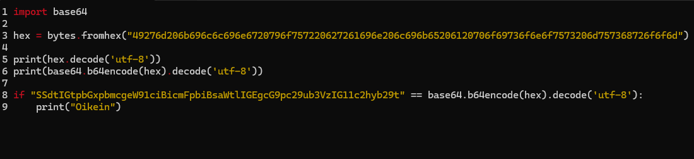

Pythonista löytyy valmis base64 kirjasto, joka osaa kääntää bytes objektista valmiin enkoodatun pätkän.

Bytes on taas objekti, joka käytännössä muuttumaton sarja tavuja. Objekti voidaan alustaa suoraan hex koodilla fromhex() metodilla.

Näiden kahden lisäksi koodista löytyy printit, joissa dekoodataan hex, base64 koodi ja Teron neuvojen kanssa vielä tarkistetaan vastaus if lausekkeella, joka tulostaa "Oikein, jos base64 vastaa haasteen toivottua lopputulosta

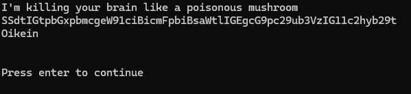

### b) 

Setin seuraavassa tehtäväss tulee kääntää hex merkkijono XOR operaattorilla. Avaimena ei ole yksittäinen merkki vaan hex merkkijonolle on vastaava yhtä pitkä lista, jonka avulla se voidaan kääntää

Hex:
```
1c0111001f010100061a024b53535009181c
```
Avain:
```
686974207468652062756c6c277320657965
```
Vastaus:
```
746865206b696420646f6e277420706c6179
```

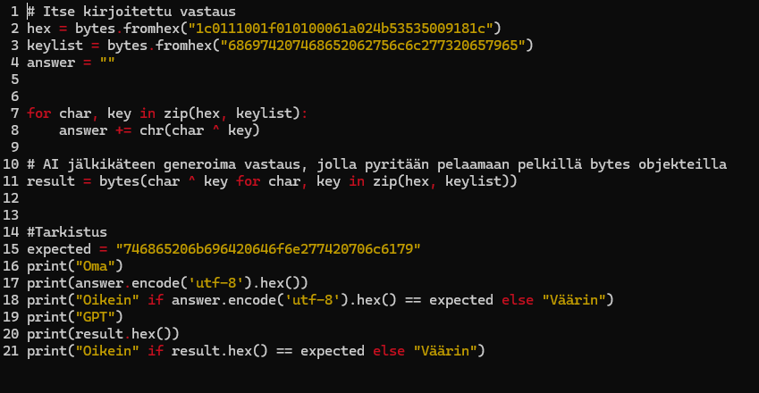

Tällä kertaa koodissa on kaksi vastausta, sillä tein tämän uudestaan AI:n kanssa. Ensimmäisessä haastessa kehotetaan käsittelemään merkkijonoja bytes datana, jota en osannut itse heti käyttää ilman apuja, joten tein sen uudestaan avun kanssa. Vastaus on sama kummassakin toteutuksessa, ensimmäisessä on vain toteutus, missä käytetään strings muuttujaa vastauksen muodostamiseen.

zip() metodi yhdistää kaksi listaa, ja niitä voidaan käsitellä for loopissa koodissa esitettyyn tapaan. Python osaa käsitellä merkkijonoa listana, joten erillinen muutos listaksi ei ole tässä tapauksessa tarpeen vaan merkkijonoja voi iteroida merkki kerrallaan.

Eli for lauseke iteroi merkin hex koodista ja avaimesta, joita verrataan keskenään XOR operaattorilla, jolloin toivottu merkki muodostuu ja se lisätään vastaukseen.

Esimerkkinä voidaan käytä läpi ensimmäinen merkki, joka on hex koodissa 0x1c ja avaimessa 0x68, eli binääreissä 00011100 ja 01101000. Binääri arvot saa python tulkilla käskyllä bin(), mutta se poistaa luvun alussa olevat nollat, eli ne pitää itse lisätä, jotta se vastaa oikeaa tavua, eli kahdeksaa bittiä.
```
00011100 ^ 01101000 = 01110100
```
01110100 binääri taas vastaa hexadesimaalissa 74:ää, joka on oikean vastauksen ensimmäinen merkki

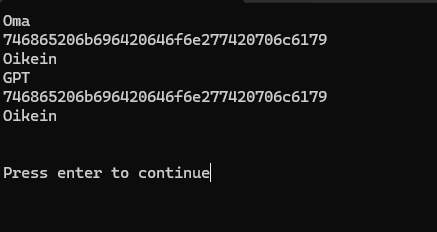

Koodista taas löytyy if lauseke, joka tulostaa oikein / väärin, riippuen vastaako vastaus toivottua merkkijonoa.

### c)

Kolmannessa haastessa tulee selvittää todennäköisin vastaus annettulla hex koodilla, käyttämällä XOR operaattoria. Tällä kertaa avaimen toimii kuitenkin yksittäinen merkki.

Hex:
```
1b37373331363f78151b7f2b783431333d78397828372d363c78373e783a393b3736
```

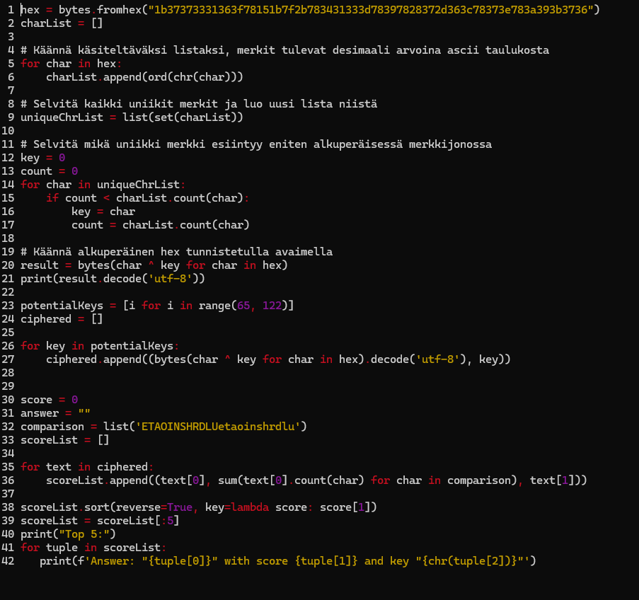

Koodi on taas kirjoitettu kahdesti, sillä ymmärsin tehtävän annon pelkillä cryptopals ohjeilla, ehkä hieman väärin.

Ensimmäinen totetus selvittää annetusta merkkijonsta yleisimmän merkin ja käyttää sitä dekryptaamaan itsensä. Toteutus itsessään toimi oikein, mutta luettuani Teron sivulta vinkkejä tähän tehtävään arvioin, sen olevan kuitenkin väärin. Testi kuvassa tämän toteutuksen vastaus on ensimmäisellä rivillä.

Toinen toteutus on enemmän hutkitaan ja sitten tutkitaan tyylinen, jossa luodaan ensimmäiseksi kaikki mahdolliseti avaimet, eli aakkoset isoina ja pieninä kirjaimina(ascii taulussa desimaaleina 65-122), jonka jälkeen luodaan lista kaikista mahdollisista vastauksista, sekä sen vastaavasta avaimesta tuplena.

Seuraavaksi 'arvostellaan' kaikki tekstit count() metodilla, jonka avulla lasketaan monta kertaa merkit 'ETAOIN SHRDLU etaoin shrdlu' esiintyvät merkkijonossa, jotka ovat yleisimmät englannin kielessä käytetyt merkit. 

Arviot, teksti ja avain lisätään tuplena uuteen listaan, joka järjestellään laskevaan järjestykseen sort() metodilla ja avaimena käytetään tuplen sisäistä 'pistemäärää'. Tämän jälkeen lista leikataan sisältämään vain viisi ensimmäistä alkiota.

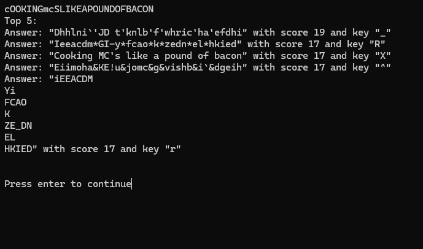

Tehtävässä oli selvittää algoritmin/pisteytyksen perusteella ja 'oikea' vastaus olisi ensimmäinen listasta. Jos taas oletetaan, että vastaus on selkokielinen on kolmas teksti parempi vaihtoehto. Tehtävässä ei kuitenkaan annettu oikeaa vastausta, joten Teron sivun neuvon mukaisesti vastauksena toimii top 5 lista.

Ensimmäinen toteutus pääsi, kuitenkin yllättävän lähelle selkokielistä vastausta. Testissä sitä ei lue, mutta todennäköisin avain ensimmäisen toteutuksen perusteella oli 'x' ja vaikka se heittää 'X':stä -32 on tuloste yllättävän saman näköinen

### d)

Neljännessä haasteessa tulee selvittää mikä annetusta tekstitiedoston hex koodeista on enkryptattu viesti. Kaikki muut koodit tiedostossa on generoituja.

Edelliseen verrattuna tehtävä vaikeitui huomattavasti, mutta lähinnä sen takia, koska ainakin omalta osalta isoin ongelma oli koodien muodon säilitys, jota ilman tulos vääristyi aika radikaalisti. Samalla kyllä tuli testattua, muita mahdollisia lisäyksiä pisteytys algotrimiin, mutta niitä ei kuitenkaan toteutettu lopullisessa ratkaisussa.

Myös tulostuksessa on oma ongelmansa, sillä muut tulokset ovat niin randomeita, ettei dekoodaus toimi globaalisti. Koska tehtävän anto pyysi kuitenkin selvittämään vain oikein rivin, avaimen ja viestin, en jaksanut enään korjata tulostetta siistimpään muotoon.

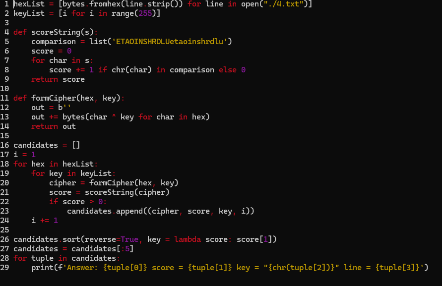

Edelliseen tehtävään verrattuna ideana on iteroida avaimen lisäksi myös hex merkkijonoja. 
Muuten idea on sama -> Käännetään merkit -> Pisteytetään merkkijono -> Lisätään listaan pisteen kanssa -> filtteröidään lista näyttämään top 5 pisteiden mukaan.

Tärkeimmät erot ja parannukset omasta mielestä edelliseen toteutukseen olivat;

- Merkkijonon alustus b'', joka varmistaa että käännetty merkijono pysyy bytes objektina.
- Avaimen rangen lisäys kaikkiin arvoihin, avain saattaa nimittäin olla aakkosten ulkoupuolella.

Muita avattavia kohtia;
- open() metodi, jonka default asetus on luku moodi ja se palauttaa wrapperin tiedoston sisällöstä.
Sitä voi suoraan iteroida rivi kerrallaan, mutta tässä tapauksessa siihen on lisätty strip() metodi, joka poistaa txt tiedostossa näykmättömän rivinvaihto merkin, eli '\n'
- Itselle oli vaikea aluksi hahmottaa miten bytes oliota pitäisi tarkalleen käsitellä, mutta tehtävää tehdessä valkeni että sen kokonaisesta sisällöstä ei tarvirte välittää.
Kun bytes objektia iteroidaan merkki kerrallaan, se palauttaa suoraan desimaalimuodossa ascii arvon, eikä sitä tarvitse turhaan kääntää decode() metodilla.

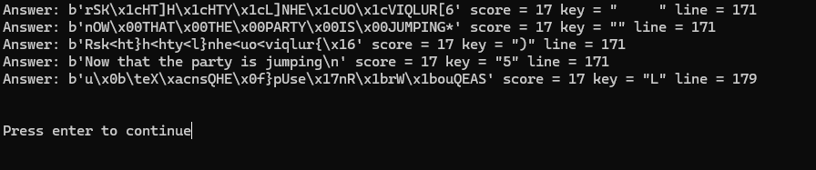

Ohjelmaa ajamalla selviää haettu rivi, avain, sekä bytes muodossa oleva merkkijono oikeasta viestistä. Yksinkertainen pisteytysjärjestelmä toimi tällä kertaa, mutta ideaalisesti olettaisin, että oikea merkkijono löytyy parhailla pisteillä, eikä jaetulta pokaalilta.

Lyhyellä koodilla, voidaan vielä varmistaa vastuaus.
```
hex = bytes.fromhex(input("Anna hex: "))
key = ord(input("Anna avain: "))

out = b''
out += bytes(char ^ key for char in hex)

print("".join(chr(char) for char in out))
```
Eli oikea vastaus on rivin 171 hex koodi ja avain on '5'

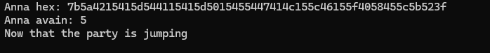

### e)

Viidennessä haastessa tulee kryptata merkkijonot toistuvalla XOR avaimella, jonka arvot ovat I,C ja E.

Merkkijonot
```
Burning 'em, if you ain't quick and nimble
I go crazy when I hear a cymbal
```
Toivottu lopputulos:
```
0b3637272a2b2e63622c2e69692a23693a2a3c6324202d623d63343c2a26226324272765272a282b2f20430a652e2c652a3124333a653e2b2027630c692b20283165286326302e27282f
```

Tällä kertaa ainoa mikä vähän hämäsi oli toivottu lopputulos, joka oli laitettu kahteen osaan todella oudosti haasteen sivulle. Oletettavasti ensimmäinen lause vastaisi ensimmäistä hex koodia, mutta sivulla se taitaa olla laitettu merkin kohdalta poikki ja jatkettu uudella rivillä :D

Koodi:
```
input = b"Burning 'em, if you ain't quick and nimble\nI go crazy when I hear a cymbal"
key = b"ICE"

out = b''
i = 0
for char in input:
    if i == 3:
        i = 0
    out += bytes([char ^ key[i]])
    i += 1

print(out.hex())

correct = bytes.fromhex("0b3637272a2b2e63622c2e69692a23693a2a3c6324202d623d63343c2a26226324272765272a282b2f20430a652e2c652a3124333a653e2b2027630c692b20283165286326302e27282f")

print("Oikea vastaus!" if correct == out else "Väärä vastaus")
```

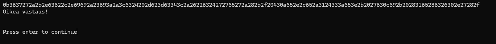

Testi tulostaa kryptatun viestin, sekä vertaa sitä haasteessa annettuun oikeaan vastaukseen.

### f)

Kuudennessa tehtävässä tulee purkaa enkoodattu tekstiteidosta. Tehtävän kanssa meni todella pitkään ja oma toteutus toimi vain osapuilleen. Netistä löytyi onneksi NCC Group Globalin video, jonka avulla tehtävän sai tehtyä edes siten, että avaimen pystyy päättelemäään ja kääntämään sen siten manuaalisesti.

Omassa toteutuksessa luultavasti meni eniten mönkään algoritminssä, joka tunnistaa merkkien tiheyden ja 
'toimivassa' toteutuksessa sekin tarvitsee hienosäätöä. 

Lähteisiin on lisätty kaikki cryptopalsin quided NCC Group Globalilta, mutta niitä on käytetty vain tähän toteutukseen. Muut videot ovat kuitenkin mielenkiintoisia ja niistä sai aika paljon irti.

'Toimiva' toteutus:
```
from base64 import b64decode
import itertools
from eng_score import  evaluate_string
from pprint import pprint 

def hammingWheight():
    weights = {0:0}
    pow2 = 1
    for _ in range(8):
        for k, v in weights.copy().items():
            weights[k+pow2] = v+1
        pow2 <<= 1
    return weights
weights = hammingWheight()

def bytesXor(a: bytes, b: bytes):
    return bytes((byte1 ^ byte2) for byte1, byte2 in zip(a, b))

def hammingCalc(s1, s2):
    return sum(weights[byte] for byte in bytesXor(s1, s2))

MAX_KEYSIZE = 40
def guessKeysize(ct: bytes, guesses: int = 1):
    def get_score(size: int):
        chunks = (ct[:size],
                  ct[size:2*size],
                  ct[2*size:3*size])
        avg = sum(hammingCalc(a, b) for a, b in itertools.combinations(chunks, 2)) / 6
        return avg / size
    
    scores = [(get_score(size), size) for size in range(2, MAX_KEYSIZE+1)]
    scores.sort()
    return scores[:guesses]

def crackRepeatingXor(cipher: bytes, keysize: int):
    chunks = [cipher[i::keysize] for i in range(keysize)]
    cracks = [crackSingleXor(chunk) for chunk in chunks]

    combinedScore = sum(guess[0] for guess in cracks) / keysize
    key = bytes(guess[1] for guess in cracks)
    return combinedScore, key

def crackSingleXor(cipher: bytes):
    canditates = []

    for keyCanditate in range(256):
        fullKey = bytes([keyCanditate]) * len(cipher)
        plaintext = bytesXor(fullKey, cipher)
        score = evaluate_string(plaintext)
        canditates.append((score, keyCanditate))
    
    canditates.sort(reverse=True, key=lambda score: score[0])
    return canditates[0]

def repeatingXor(cipher: bytes, key: int, keysize: int):
    out = b''
    i = 0
    for byte in cipher:
        if i == keysize:
            i = 0
        out += bytes([byte ^ key[i]])
        i += 1
    
    return out
    

if __name__=="__main__":
    assert hammingCalc(b'this is a test', b'wokka wokka!!!') == 37

    with open("./6.txt") as f:
        b64 = f.read()
    ciphertext = b64decode(b64)
    keysizes = guessKeysize(ciphertext, 5)
    
    canditates = [crackRepeatingXor(ciphertext, guess) for _, guess in keysizes]
    canditates.sort()
    bestCandidate = canditates[0]
    bestKey = bestCandidate[1]
    print("bestkey: ")
    pprint(bestKey.decode('ascii'))
    print(repeatingXor(ciphertext, bestKey, len(bestKey)).decode('ascii'))

```
- Tämän toteutuksen hamming weight on suoraan sovellettu videoista, mutta lopputulos on sama kuin ensimmäisessä yrityksessä.
- Videolla: https://www.youtube.com/watch?v=YTA6sXNgMRE selitetään sen hamming ja weights toiminta todella hyvin, mutta käytännössä 'weights' parametri sisältää kaikki mahdolliset tavut, eli se sisältää 256 tavua dictionary muodossa, johon verrataan saatua Xor tavua
- Saman asian voi toteuttaa esimerkiksi vertamalla xor operaattorilla tavuja ja laskemalla tuloksesta jokaisen esiintyvän '1' arvon, sillä jos merkit ovat samat eli 1 ^ 1 | 0 ^ 0 on tulos 0, kun taas eriävä 0 ^ 1 on 1
- bytesXor palautta kahden samanpituisen bytes objektin xor operoidun muodon
- guessKeysize käy läpi 2-40 pituudet ja arvioi ne hamming arvon mukaan
- crackRepeatingXor ottaa kryptatun bytes objektin ja avainkoon ja käy läpi kaikki mahdolliset avain kombinaatiot ja palauttaa sen, jolla on parhaat pisteet.
- crackSingleXor ottaa kryptatun bytesin ja arvioi todennäköisimmän avaimen, jonka se palauttaa pisteiden kanssa
- repeatingXor avaa kryptatun tekstin plaintekstiksi
- main lohkossa oleva assert varmistaa erikseen hamming laskurin toimivuuden vertaamalla haastessa annettun sanaparin tulosta odotettuun tulokseen

Importoitu eng_score:
```
def evaluate_string(data: bytes) -> float:
    frequency_table = {
        101: 12.02,  # e
        116: 9.10,   # t
        97: 8.12,    # a
        111: 7.68,   # o
        105: 7.31,   # i
        110: 6.95,   # n
        115: 6.28,   # s
        114: 6.02,   # r
        104: 5.92,   # h
        100: 4.32,   # d
        108: 3.98,   # l
        117: 2.88,   # u
        99: 2.71,    # c
        109: 2.61,   # m
        102: 2.30,   # f
        121: 2.11,   # y
        119: 2.09,   # w
        103: 2.03,   # g
        112: 1.82,   # p
        98: 1.49,    # b
        118: 1.11,   # v
        107: 0.69,   # k
        120: 0.17,   # x
        113: 0.11,   # q
        106: 0.10,   # j
        122: 0.07,   # z
    }
    score = 0.0
    for byte in data:
        if byte in frequency_table:
            score += frequency_table[byte]
    return score
```

Ohje videoissa avattiin lyhyesti esiintyvyyksiä, joiden pohjalta tein päätöksen poistaa isot kirjaimet vääristämästä tulosta. Kokonaisissa lauseissa ja sanoissa on paljon enemmän pieniä kirjaimia, joten sekamelskassa olevat isot kirjaimet, voivat vääristää tulosta.

Tähän versioon vaihdettiin avaimen pituutta selvittäessä, joten en osaa sanoa olisiko tulos ollut yhtä hyvä isoilla kirjaimilla.

Esiintyvyys luvut haettu osoitteesta: https://pi.math.cornell.edu/~mec/2003-2004/cryptography/subs/frequencies.html

Viimeiseen tarkastukseen käytetty koodi:
```
from base64 import b64decode

def decryptRepeatingXor(cipher: bytes, keysize: int, key: int):
    out = b''
    i = 0
    for byte in cipher:
        if i == keysize:
            i = 0
        out += bytes([byte ^ key[i]])
        i += 1
    
    return out

if __name__=="__main__":
    with open("./6.txt") as f:
        b64 = f.read()
    ciphertext = b64decode(b64)
    avain = (bytes(input("Anna avain: "), 'ascii'))

    print(decryptRepeatingXor(ciphertext, len(avain), avain).decode('ascii'))
```
Ohjelma on tehty tarkoituksella hieman 'oudosti' tulevaisuutta varten, jos tarve tulee kääntää samalla metodilla koodia, voidaan importoida funktio tästä suoraan. Ajamalla sitä suoraan, voidaan kääntää 6.txt tiedosto.

Ajamalla toteutus saadaan irti avain, sekä jokseenkin vielä sekava plainteksti.
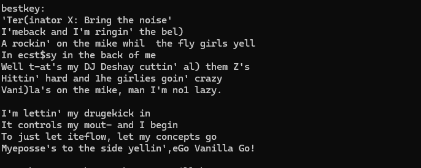

Päättelemällä avaimen testissä, voidaan saada oikea tuloste auki dekryptaamalla se toisessa sovelluksessa.
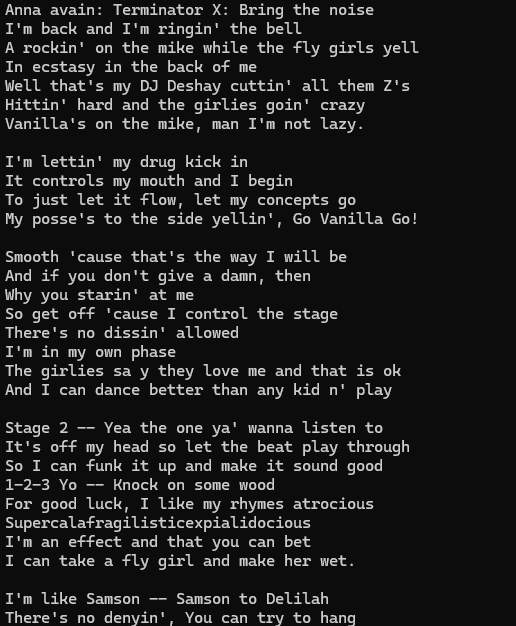

## Alusta:
    Kaikki on ohjelmat kirjoitettu host koneella ja testit on tehty kontissa microlla, mutta ne myös toimivat windowsilla python3 kääntäjällä.
    
    Imageen on asennettu Teron suosittelemat micro lisärit, dockerfile löytyy python kansiosta

## AI:n käyttö
    Suurin osa varsinkin ensimmäisistä toteutuksista on kirjoitettu kokonaan käsin, mutta varskin haastavammissa tehtävissä sitä on käytetty luomaan ratkaisuja lähinnä listojen, bytes yms. käsittelyn kanssa, mutta nekin ovat olleet lähinnä kopittelua ja ideoiten heittoa. Toteutukset on kuitenkin sovellettu itse ohjelmaan, eikä apinoitu suoraan generoiduista vastauksista.

    Huvittan osuus oli copilotin eettiset rajat, kun yritin luoda kuutos haasteeseen listaa yleisistä englannin kielen fraaseista, joilla yritin toista pisteytystä. ChatGPT kuitenkin iloisesti auttoi tämänkin suhteen.

    Muuten AI työkaluja on käytetty avaamaan esim. tuplen käyttöä ja XOR operaattorin toimintaa, sekä generoimaan kirjain tiheys taulukko, jossa käytettiin apuna erkkosivulta löytyvää kuvaa/taulukkoa.

## lähteet:
https://www.geeksforgeeks.org/get-the-logical-xor-of-two-variables-in-python/

https://docs.python.org/3/library/stdtypes.html#bytes-objects

https://stackoverflow.com/questions/15489612/counting-occurrences-of-multiple-strings-in-another-string

https://terokarvinen.com/getting-started-python-cryptopals/

https://www.geeksforgeeks.org/hamming-distance-two-strings/

https://www.geeksforgeeks.org/introduction-to-levenshtein-distance/

https://docs.python.org/3/library/itertools.html#itertools.product

https://pi.math.cornell.edu/~mec/2003-2004/cryptography/subs/frequencies.html

https://www.youtube.com/playlist?list=PLWvDpnCcem1P6i8pZm2x7KHp5iaxwrK_P

https://terokarvinen.com/getting-started-python-cryptopals/

https://www.asciitable.com/